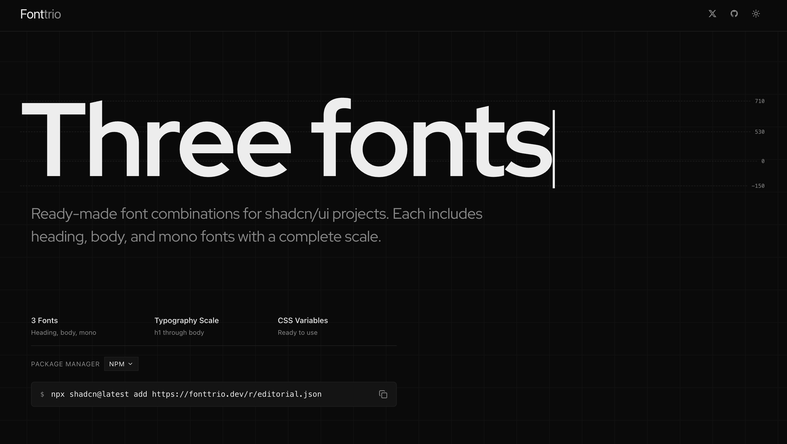

# Fonttrio



Three fonts. One command.

Fonttrio is a curated collection of font pairings designed specifically for shadcn/ui projects. Each pairing includes a carefully selected combination of heading, body, and monospace fonts that work together harmoniously.

## Why Fonttrio?

Building a typography system from scratch is time-consuming. Finding fonts that complement each other, establishing the right scale, and setting up CSS variables takes hours of work. Fonttrio solves this by providing ready-made, battle-tested font combinations that you can install in seconds.

## Features

- **49 Curated Pairings** — From editorial to corporate, minimal to bold
- **Complete Typography Scale** — Each pairing includes h1 through body sizing
- **CSS Variables** — Ready-to-use CSS custom properties for easy theming
- **One Command Install** — Add any pairing to your project instantly
- **Google Fonts Integration** — All fonts loaded from Google Fonts CDN
- **Dark Mode Ready** — Works seamlessly with shadcn/ui's theming system

## Quick Start

### Install a pairing

```bash
npx shadcn@latest add https://www.fonttrio.xyz/r/editorial.json
```

Replace `editorial` with any pairing name from our collection.

### Use in your project

Once installed, the pairing automatically sets up CSS variables:

```css
/* These variables are now available */
--font-heading
--font-body
--font-mono
```

Apply them in your components:

```tsx
<h1 className="font-[family-name:var(--font-heading)]">
  Your Heading
</h1>
<p className="font-[family-name:var(--font-body)]">
  Your body text
</p>
```

## Browse Pairings

Visit [fonttrio.dev](https://www.fonttrio.xyz) to browse all available pairings. Each pairing page includes:

- Live preview with actual fonts
- Typography scale visualization
- Type tester for custom text
- Context previews (blog, landing, docs)
- One-click install command

## Available Pairings

### Editorial
Sophisticated combinations for content-heavy sites
- **Editorial** — Playfair Display + Source Serif Pro + Fira Code
- **Literary** — Crimson Text + Source Serif Pro + IBM Plex Mono
- **Newspaper** — Merriweather + Merriweather + Cousine

### Clean
Minimal, modern combinations
- **Minimal** — Inter + Inter + JetBrains Mono
- **Clean** — Space Grotesk + Space Grotesk + Space Mono
- **Swiss** — Work Sans + Work Sans + Source Code Pro

### Bold
High-impact combinations for marketing
- **Impact** — Bebas Neue + Barlow + Fira Code
- **Poster** — Alfa Slab One + Assistant + Roboto Mono
- **Headline** — Anton + Heebo + Fira Code

### Corporate
Professional combinations for business
- **Corporate** — Raleway + Open Sans + Roboto Mono
- **Protocol** — Sora + Inter + JetBrains Mono
- **Fintech** — Plus Jakarta Sans + Inter + Source Code Pro

### Creative
Unique combinations for portfolios and creative work
- **Creative** — Syne + Manrope + Fira Code
- **Studio** — Space Grotesk + DM Sans + Fira Code
- **Agency** — Schibsted Grotesk + Karla + Fira Code

## How It Works

Fonttrio uses the shadcn/ui registry system to distribute font pairings. When you install a pairing:

1. The fonts are configured in your Next.js app via next/font
2. CSS variables are set up in your globals.css
3. Typography scale is applied through CSS
4. All components can use the font variables immediately

## Requirements

- Next.js 14+ with App Router
- shadcn/ui installed
- Tailwind CSS

## Customization

Each pairing comes with sensible defaults, but you can customize:

### Change scale
Edit the CSS variables in your `globals.css`:

```css
:root {
  --font-heading: var(--font-your-choice);
  --font-body: var(--font-your-choice);
  --font-mono: var(--font-your-choice);
}
```

### Mix and match
Install multiple pairings and switch between them:

```bash
npx shadcn@latest add https://www.fonttrio.xyz/r/minimal.json
npx shadcn@latest add https://www.fonttrio.xyz/r/editorial.json
```

## Contributing

Found a great font combination? Open an issue with your suggestion.

## License

MIT — Use these pairings in any project, commercial or personal.

## Credits

Built by [Dima Kapish](https://x.com/kapish_dima) for the shadcn/ui community.

---

**Fonttrio** — Because life's too short for bad typography.
